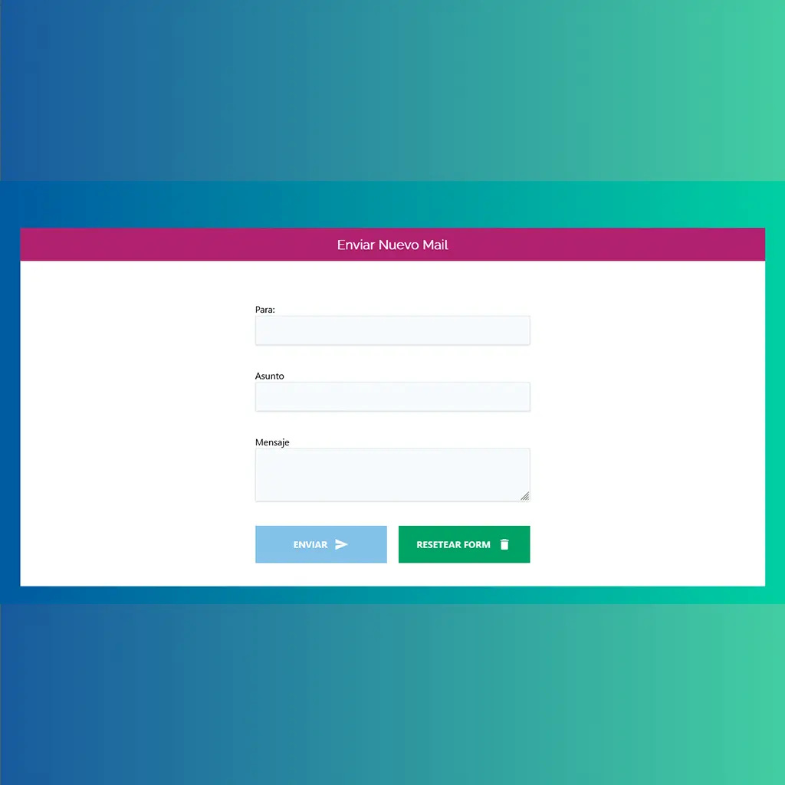
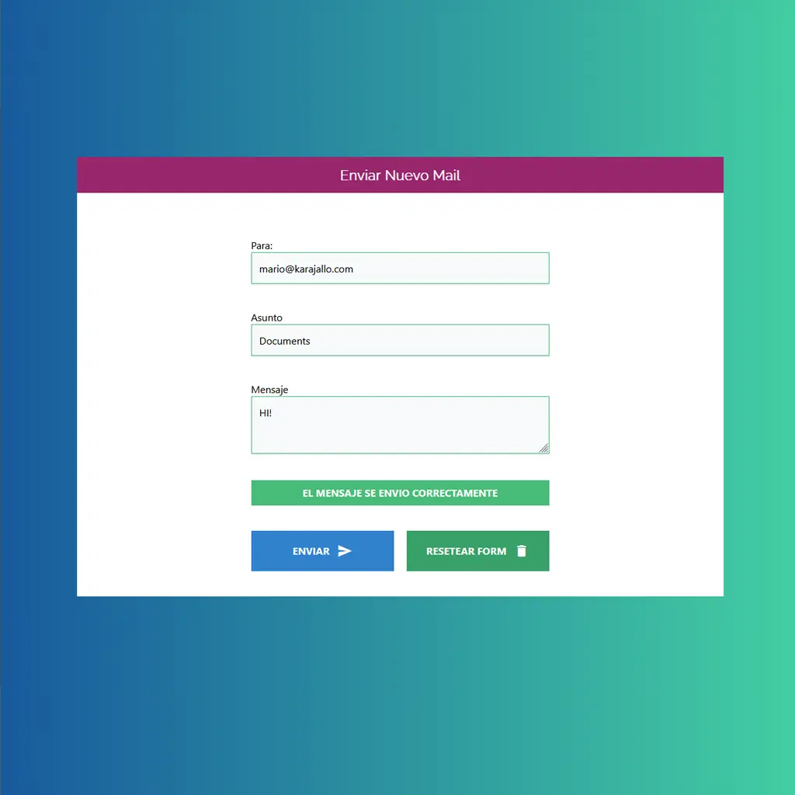
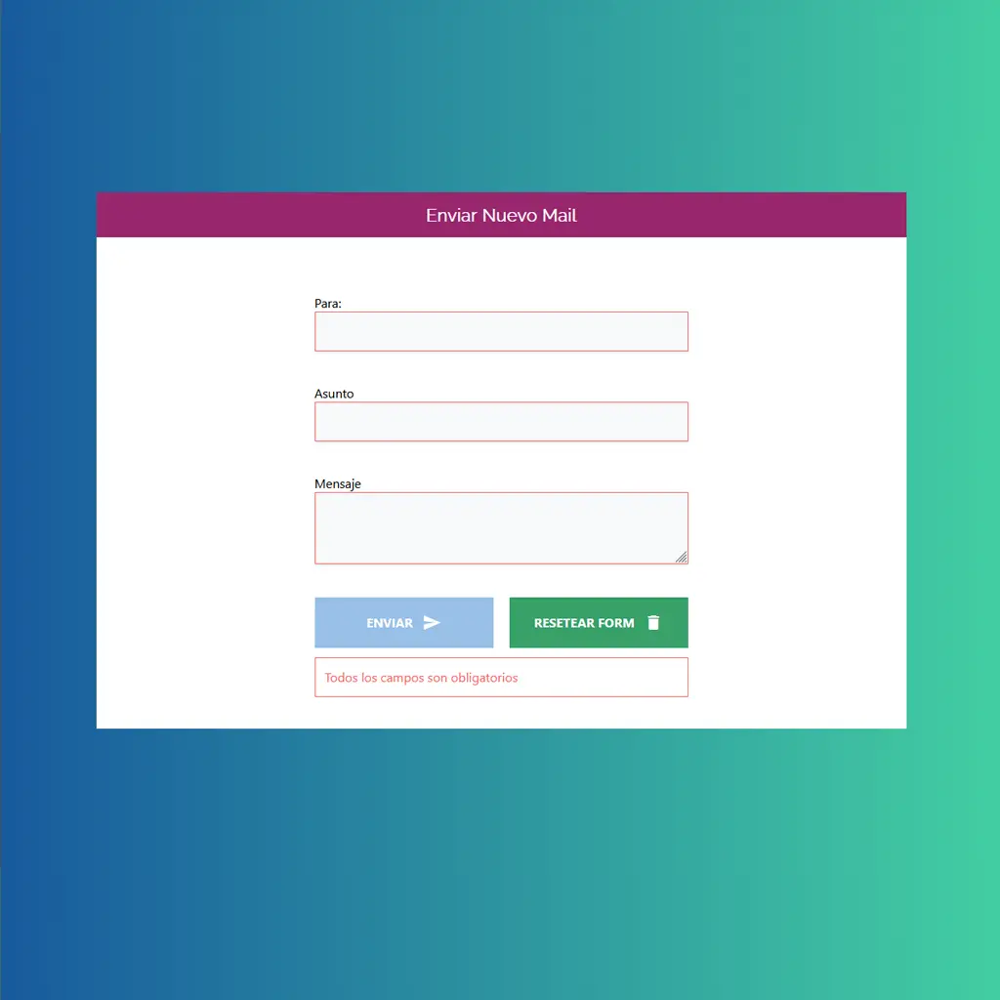

## Mail Simulator
Simulador simple de envío de correos en el navegador. Permite completar un formulario con `email`, `asunto` y `mensaje`, valida los campos, muestra errores, simula el envío con un spinner y muestra un mensaje de éxito.

## Demo

Para mirar la demo del proyecto visita: [Mail Simulator](https://jsproyecto2.netlify.app/)  


<br>

<br>

<br>

## Características

- Validación de campos (campos requeridos).
- Validación de formato de correo electrónico mediante expresión regular.
- Feedback visual en los campos (borde rojo/verde).
- Mensajes de error agregados al formulario.
- Botón de enviar deshabilitado hasta que el formulario sea válido.
- Spinner que simula el proceso de envío y mensaje de éxito.
- Botón para resetear el formulario.

## Tecnologías utilizadas

- **HTML**: estructura del formulario y la página.
- **CSS**: estilos (incluye `custom.css` y `tailwind.min.css`).
- **JavaScript (vanilla)**: lógica de validación, control de eventos y simulación de envío (`js/app.js`).

## Instalación y requisitos

- Requisitos: navegador moderno (Chrome, Firefox, Safari) y permisos locales para abrir archivos HTML.
- No requiere compilación ni dependencias externas.
- Pasos para ejecutar localmente:

```bash
# clonar el repositorio (si aplica)
git clone https://github.com/mariokarajallo/mail-simulator-java-script.git
cd mail-simulator-java-script

# Abrir `index.html` en tu navegador
open index.html
```

## Cómo funciona

1. La aplicación carga y deshabilita el botón `Enviar` por defecto.
2. El usuario completa los campos `email`, `asunto` y `mensaje`.
3. Al perder el foco (`blur`) de cada campo se valida su contenido:
	- Si está vacío, se marca con borde rojo y se muestra un mensaje de error.
	- Si tiene contenido válido, se marca con borde verde.
4. El campo `email` además se valida con una expresión regular.
5. Cuando todos los campos cumplen las validaciones, el botón `Enviar` se habilita.
6. Al enviar (click en `Enviar`) se muestra un `spinner` durante 3 segundos, luego aparece un mensaje de éxito y el formulario se resetea.

### Validaciones

- Campos obligatorios: `email`, `asunto`, `mensaje`.
- Formato de email: validado con la expresión regular definida en `js/app.js` (`er`).
- Habilitación del botón: sólo cuando `email` pasa la regex y `asunto` y `mensaje` no están vacíos.

## Estructura de archivos

```bash
mail-simulator-java-script/
├── index.html
├── LICENSE
├── README.md
├── css/
│   ├── custom.css
│   └── tailwind.min.css
├── fonts/
│   └── roboto/
├── js/
│   └── app.js
└── mail-simulator-*.webp
```

## Contribuciones

- Si quieres contribuir, abre un issue o un pull request en el repositorio.
- Sugerencias: mejoras en accesibilidad, pruebas adicionales y mejoras en la UX del formulario.

## **Créditos**

- **Juan Pablo De la Torre Valdez** - Instructor y autor del contenido del curso - [Codigo Con Juan](https://codigoconjuan.com/).
- **Mario Karajallo** - Implementación del proyecto y mantenimiento - [Mario Karajallo](https://karajallo.com).

## **Licencia**

Este proyecto está bajo la licencia MIT. Véase `LICENSE.md` para más detalles.

---

⌨️ con ❤️ por [Mario Karajallo](https://karajallo.com)
